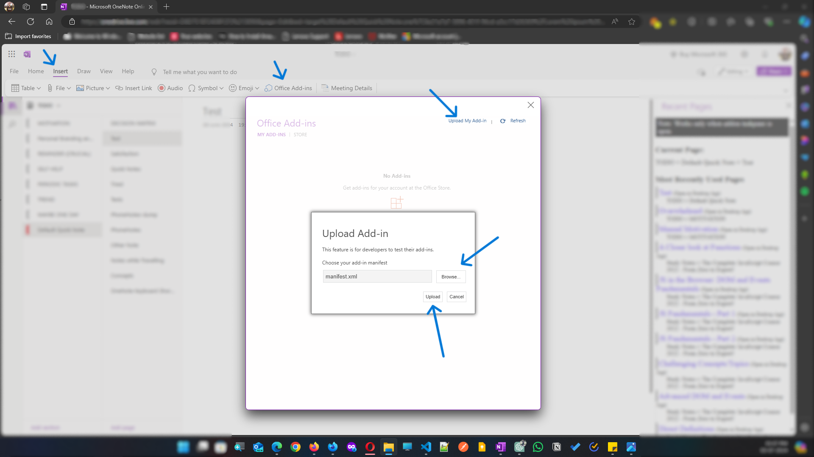
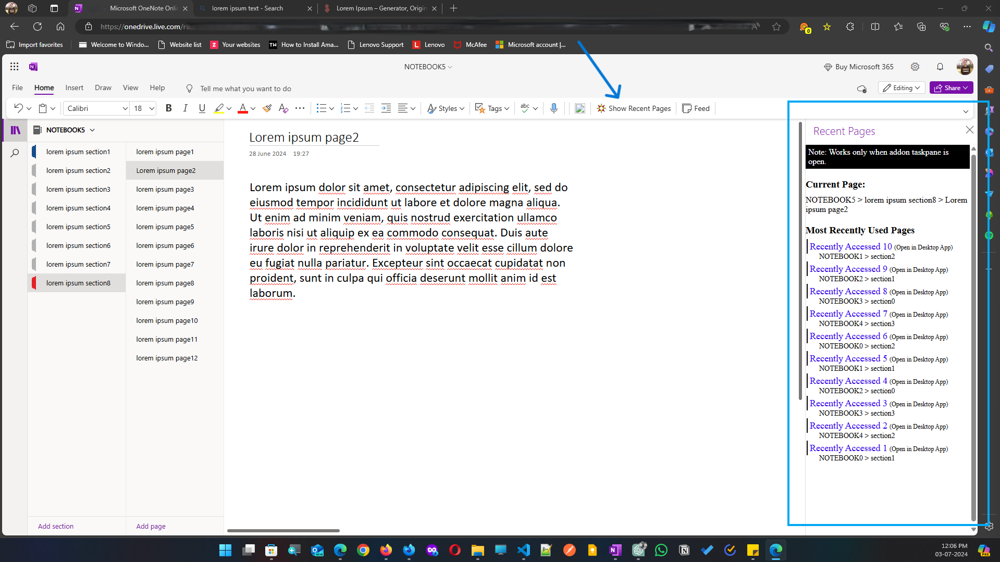

# Recent Pages OneNote Addin

### Template Used for Addin:

    - Office-Addin-TaskPane-JS for onenote
        - https://github.com/OfficeDev/Office-Addin-TaskPane-JS
        - https://github.com/OfficeDev/Office-Addin-TaskPane-JS/blob/master/manifest.onenote.xml

## Overview

This OneNote Web Add-in provides a taskpane that displays breadcrumb navigation for the current page's directory (Notebook > Section > Page). It also lists the most recently used pages within the same taskpane.

## Features

- **Breadcrumb Navigation**: Displays the directory of the current page.
- **Recently Used Pages**: Lists the pages that have been accessed most recently.

## Prerequisites (as a user)

- [OneNote](https://www.onenote.com/) with an account

## Tools Used

- [Node.js](https://nodejs.org/)
- [Visual Studio Code](https://code.visualstudio.com/) or another text editor
- [OneNote](https://www.onenote.com/) with an account
- [OneNote JavaScript API](https://learn.microsoft.com/en-us/office/dev/add-ins/onenote/onenote-add-ins-programming-overview) with [OfficeJS](https://learn.microsoft.com/en-us/office/dev/add-ins/onenote/onenote-add-ins-programming-overview)

## Recent Pages Addin for OneNote Web is hosted with github can be sideloaded to your onenote by following below steps:

### Sideload Addon:

Open OneNote for Web > Insert > Office Add-ins > Upload My Add-in > browse and select downloaded [manifest.xml](https://softwaredev-sk.github.io/recent-pages-onenote-addin/) and click upload.
Go To 'Home' Tab > Click 'Show Recent Pages', and it will show the taskpane for recently visited pages alongwith the current page on top.

## Screenshots

**Note:** The hierarchy doesn't check for notebook group, section group or page levels. The page structure shown is

- Parent Notebook > Parent Section > Page

---

[Read here](), how to get recent pages in desktop (windows) app with native approach.
